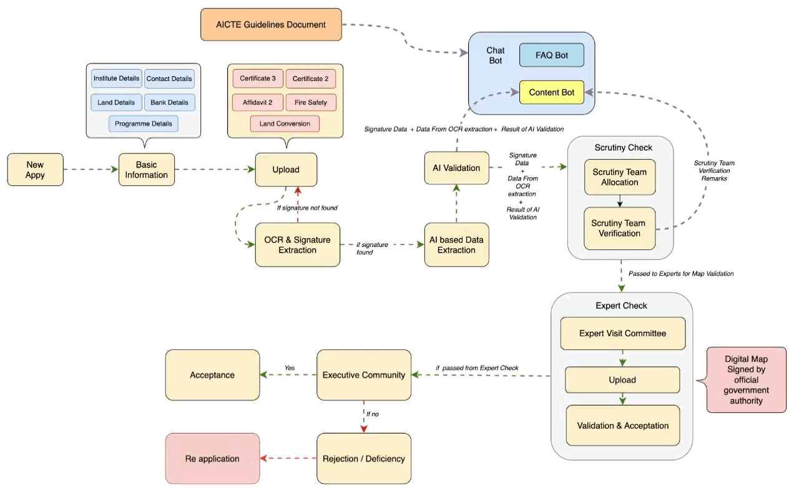
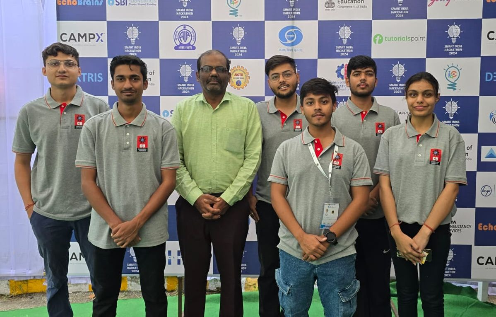

# AICTE Approval System

## 🚀 Project Overview
The **Portal Automation** project aims to streamline the document verification process on portals like the AICTE portal. Currently, the process involves manual validation by admin members, which is time-consuming and prone to human error. Our solution leverages **AI** and **OCR (Optical Character Recognition)** technologies to automate this workflow.

## 📌 Problem Statement
The current AICTE approval process suffers from multiple inefficiencies:
- Delays in manual validation of institutional submissions
- Inefficient document verification
- Inequitable evaluator allocation
- Limited infrastructure compliance validation
- Poor communication and transparency

## Proposed Solution
Our system automates this process by:
1. **Extracting Keywords**: Using OCR to extract relevant information from uploaded documents.
2. **Generating Summaries**: AI processes the extracted data to create concise summaries.
3. **Reporting**: Admin members are presented with reports summarizing key findings and highlighting any discrepancies.

This solution ensures a faster, more accurate, and scalable document verification process.

## Features
- **AI-Powered OCR**: Extracts text and relevant keywords from scanned documents and images.
- **Document Validation**: Automatically checks for critical information and flags missing or invalid data.
- **Summary Reports**: Generates easy-to-read summaries for admin members.
- **Streamlined Workflow**: Reduces the manual effort required for document review.

## Technical Stack
- **Frontend**: React.js, React Native
- **Backend**: Node.js with Express, Python (FastAPI)
- **Database**: MongoDB, AWS S3
- **AI & Analytics**: TensorFlow, Large Language Models, NLP, Tesseract OCR
- **Security**: Role-Based Access Control, JWT, OpenCV

## Architectural Plan
For a detailed architectural overview, please refer to our Architectural Plan


Also , here is a detailed Point Of View with respect to the Admin Members and New Institutes
[Admin POV](Diagrams/AdminPOV.gif) | [New Institute POV](Diagrams/NewInstitutePOV.gif)

## Setup and Installation

### Prerequisites
- Node.js (v16+ recommended)
- Docker Desktop
- Python 3.8+
- npm (v8+)

### Frontend Installations

1. Clone the repository:
   ```bash
   git clone https://github.com/AyonSOMADDAR/AICTE_Portal_Automation.git
   cd AICTE_Portal_Automation
   ```
   
2. Install dependencies:
   ```bash
   npm install        # For frontend/backend dependencies
   pip install -r requirements.txt  # For AI/OCR dependencies (if using Python)
   ```

3. Set up the database:
   - Create a new database in your preferred DBMS.
   - Run database migrations (instructions depend on the framework used).


4. Start the application:
   - Frontend:
     ```bash
     npm start
     ```
   - Backend:
     ```bash
     npm run start-server  
     ```
   - Python server
     ```bash
      # Navigate to api directory
      cd api
    
      # Setup the enviornment file
      # Add the following in  .env file
    
        # Groq Configuration API Key
          GROQ_API_KEY= 'add your key here'
      
        # Google Configuration API Key
          GOOGLE_API_KEY= 'add your key here'
        
        # Google Vision Configuration API Key
          GOOGLE_APPLICATION_CREDENTIALS= 'add path to your vision secret jey json file'
        
        # MongoDB Configuration API Key
          MONGO_URI= 'add your key here'
      
    
      # Now start the docker Daemon and run 
      docker compose up --build
     ```

## Repository Structure
```
aicte-approval-system/
│
├── InstituteFrontend/
│   ├── public/
|   |    ├── favicon.ico
|   |    ├── index.html
|   |    ├── logo192.png
|   |    ├── logo512.png
|   |    ├── manifest.json
|   |    └── robots.txt
│   └── src/
|        ├── Cont ext/
│        ├── assets/
|        ├── components/
|        ├── screens/
|        ├── App.css
|        ├── App.js
|        ├── index.css
|        └── index.js
|
├── admin/
│   ├── public/
|   |    ├── favicon.ico
|   |    ├── index.html
|   |    ├── logo192.png
|   |    ├── logo512.png
|   |    ├── manifest.json
|   |    └── robots.txt
│   └── src/
|        ├── Cont ext/
│        ├── assets/
|        ├── components/
|        ├── screens/
|        ├── App.css
|        ├── App.js
|        ├── index.css
|        └── index.js
│
├── api/
│   ├── Document/
│   │   └── AICTE Doc.pdf
│   ├── codefiles/
│   |   ├── AI_Validator.py
│   |   ├── Dimension.py 
│   |   ├── DocumentChat.py
│   |   ├── Prompts.py
│   |   ├── Scheduler.py
│   |   └── StatusChat.py
|   ├── faiss_index/
|   ├── uploads/ 
|   ├── app.py
|   ├── docker-compose.yaml
|   ├── Dockefile
|   └──  requirements.txt
|   
├── backend/
│   ├── documents/
|   ├── models/
│   |   ├── MoongooseConnection.js
│   |   ├── admin.js
│   |   ├── admindata.json
│   |   ├── aicte.admins.json
│   |   ├── applications.js
│   |   ├── docResult.js
│   |   ├── institute.js
│   |   ├── logs.js
│   |   └── superAdmin.js
|   ├── routes/
│   |   ├── adminapplications.js
│   |   ├── createApplication.js
│   |   ├── getData.js
│   |   ├── login.js
│   |   ├── newApplication.js
│   |   └── verifications.js
|   ├── uploads/
|   ├── utils
│   |   ├── saveDocResult.js
│   |   └──updateApplicationUploads.js
|   ├── package-lock.json
|   ├── package.json
│   └── server.js
│
├── mobile/
│   ├── app
│   |   ├── (tabs)
|   │   |   ├── _layout.tsx
|   │   |   ├── index.tsx
|   │   |   └── profile.tsx
│   |   ├── application/[id]
|   │   |   ├── Chat.jsx
|   │   |   ├── Status.jsx
|   │   |   └── _layout.jsx
|   |   ├── assets
|   │   |   ├── +not-found.tsx
|   │   |   ├── _layout.tsx
|   │   |   └── signIn.jsx
|   ├── assets/
│   |   ├── fonts
│   |   └── images
|   ├── components/
|   ├── constants/
|   ├── hooks/
│   |   ├── useColorScheme.ts
│   |   ├── useColorScheme.web.ts
│   |   └── useThemeColor.ts
|   ├── scripts/
│   |   ├── reset-project.js
|   ├── app.json
|   ├── package-lock.json
|   ├── package.json
│   └── tsconfig.json
│   
├── CONTRIBUTION.md
|
└── README.md


```

## Our Team


**Our LinkedIn**
[Aftaab](https://www.linkedin.com/in/mohammad-aftaab-b49a5624a/) | [Harsh](https://www.linkedin.com/in/hashtagharsh/) | [Ayon](https://www.linkedin.com/in/ayonsomaddar/) | [Gaurav](https://www.linkedin.com/in/gaurav-sanwal-3263b3221/) | [Ayush](https://www.linkedin.com/in/ayush-katoch-00197021a/) | [Anushka](https://www.linkedin.com/in/anushka-gupta-90a660318/)

## Contributing
Please read CONTRIBUTING.md for details on our code of conduct and the process for submitting pull requests.

## Future Enhancements
- Enhanced security with TLS Encryption, WAF
- Improved AI validation using NER and AI modeling
- Microservice architecture development
- Expanded data storage and management capabilities
